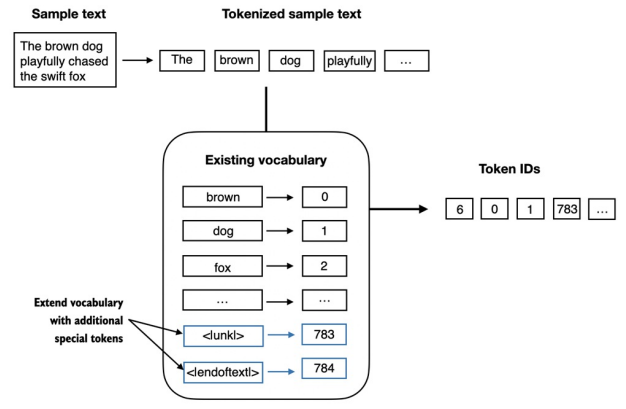
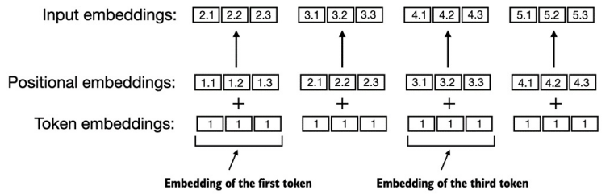
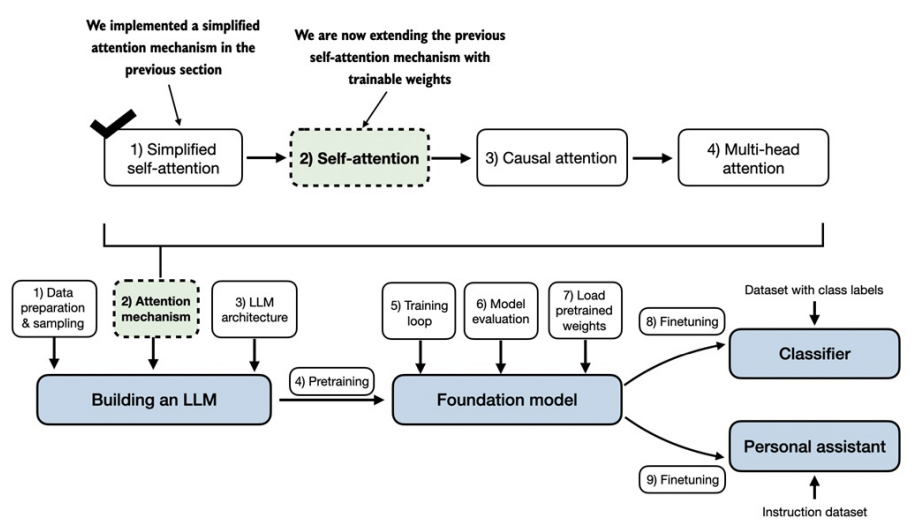
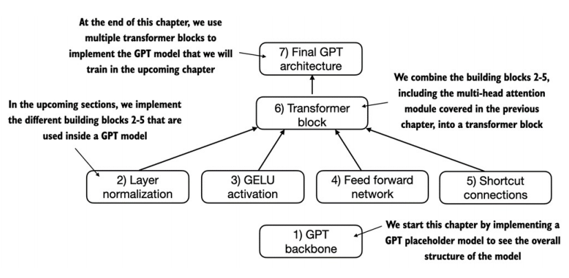
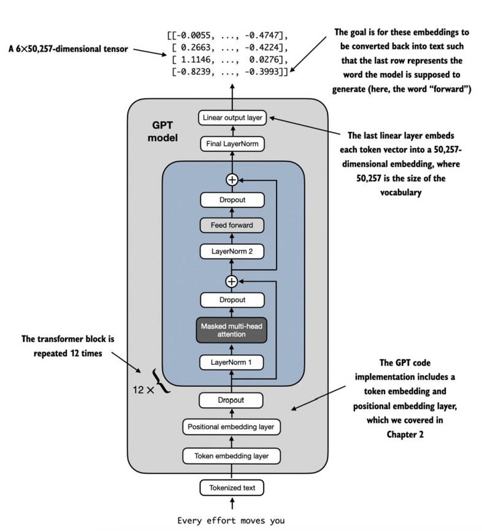
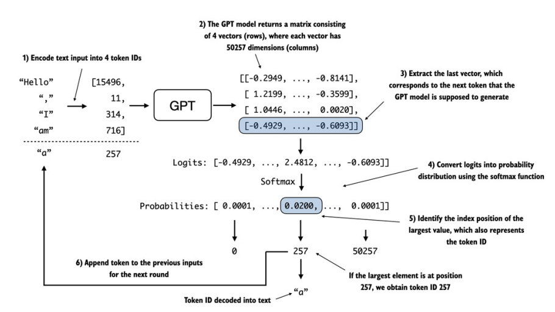
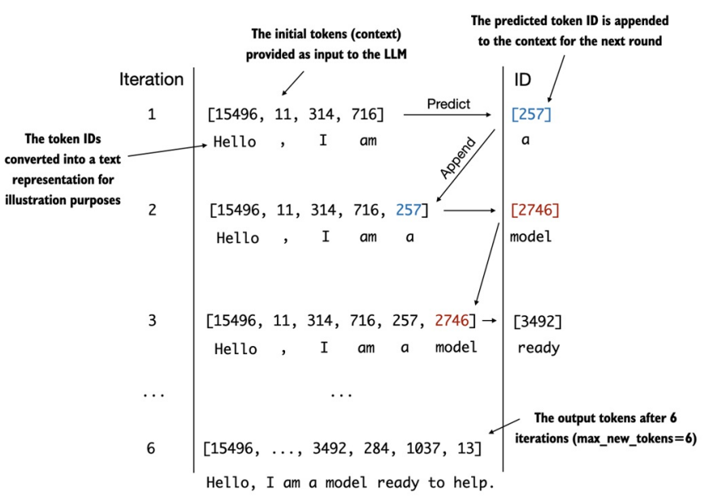

# 从零开始构建LLM

[书籍链接](https://www.manning.com/books/build-a-large-language-model-from-scratch)

## 1. LLM是什么

> 主要结构如下：从raw data中进行预训练，得出基础模型（这一部分可以了解一下元学习的概念），这个基础模型所拥有的基础能力为文本补全、短时任务的推理能力。`</br>`
> 在基础模型之上，可以导入自己标记的数据进行训练，这一部分可以成为微调（finetune），得到自己的LLM，可以用于分类，总结，翻译，个人助理等任务。


> **Transformer** 结构概览
> 1、输入需要被翻译的文本
> 2、预处理文本
> 3、编码器将输入文本进行编码
> 4、将编码部分送入解码器
> 5、模型每次只完成一个单词的翻译
> 6、预处理文本
> 7、解码器生成一个单词
> 8、完成翻译


> BERT与GPT区别：BERT更多的使用于文本填空，GPT则是预测下一个单词。


> **构建大模型步骤** `</br>`
>
> | 阶段 | 子项               |
> | ---- | ------------------ |
> | 一   | 准备数据和样本     |
> |      | 实现注意力机制     |
> |      | 实现LLM结构        |
> | 二   | 训练               |
> |      | 模型评估           |
> |      | 加载预训练模型权重 |
> | 三   | 微调自己的模型     |


---

## 2. 文本数据处理

### 2.1 词嵌入

词嵌入的根本目的是为了将非数值数据转换为向量，这样才能放入计算机进行运算。常见词嵌入的有Word2Vec。在GPT架构中，没有使用这一技术，GPT3的嵌入大小达到了12288维。其中，GPT将词嵌入作为训练模型，不断调整。也就是说，GPT将词嵌入这一部分也进行训练。


### 2.2 标记文本

首先分词，再将分词的结果用字典标记token id，token id在进行词嵌入。


在分词完成后，转换为token id需要对应的字典表。字典表，可以自己构建，通过给每个单词指定唯一id，完成之后即可完成token与id之间的互相转换。


### 2.3 特殊处理

在将文本转换为token id时，字典表的大小，覆盖全不全面，对于tokenizer是一个很严峻的考验。如果需要转换的字符不在字典表中，就需要特殊处理，另外对于不同句子之间，也需要分割符。



不同句子，不同文本之间的合并，可以使用定义的分割符进行连接


### 2.4 字节对编码（Byte pair encoding, BPE）

使用包：tiktoken

对于未知词，使用分词，然后进行编码，并根据频率进行合并。


### 2.5 使用滑窗进行数据采样


不同步长下的LLM采样


2.6 创建token嵌入


这一部分从初始化权重中根据token id进行选择。


### 2.6 编码单词位置

在上一节中，会出现如下问题，当token id一致时，从权重矩阵中选择的向量也一致。


为了解决这一问题，引入了位置编码，这样就可以保证每一个编码是独一无二的



最后，所有的数据处理流程如下：


## 3. 编码注意力机制

本节主要关注内容如下


### 3.1 长序列建模的问题

上下文丢失

### 3.2 使用注意力机制获取数据依赖关系

早期为了解决RNN对于长时序问题，研究者提出以下结构，被成为*Bahdanau attention*：


之后根据*Bahdanau attention*得到启发，提出了早期的*Transformer*结构。


### 3.3 自注意中输入的不同部分

自注意力是LLM中Transformer的基石。
在自注意力中，“自我”是指该机制通过关联单个输入序列中的不同位置来计算注意权重的能力。它关注的是本身不同部分的关系和依赖。而传统的注意力机制则是关注两个序列之间的关系

#### 3.3.1 一个简单的自我注意机制，没有训练权重


点积越大，表示相关性/相似度越高


权重归一化


#### 3.3.2 计算所有输入的注意力权重


### 3.4 使用训练权重实现自注意力



#### 3.4.1 逐步计算注意力权重

首先引入三个权重矩阵${W_q}、{W_k}、{W_v}$，用于将输入embedding。


输入与W矩阵相乘，得出注意力分数

W为权重参数，w为注意力权重

权重参数是定义网络连接的基本学习系数，而注意力权重是动态的、上下文特定的值。


注意力分数计算注意力权重（不是归一化，而是使用平方根来进行计算）


最后计算上下文向量


#### 3.4.2 实现一个紧凑的自注意力类

```python
import torch
import torch.nn as nn

class SelfAttention_v1(nn.Module):
    def __init__(self, d_in, d_out):
        super().__init__()
        self.d_out = d_out
        self.W_query = nn.Parameter(torch.rand(d_in, d_out))
        self.W_key = nn.Parameter(torch.rand(d_in, d_out))
        self.W_value = nn.Parameter(torch.rand(d_in, d_out))
  
    def forward(self, x):
        keys = torch.matmul(x, self.W_key)
        values = torch.matmul(x, self.W_value)
        queries = torch.matmul(x, self.W_query)

        attn_scores = torch.matmul(queries, keys.T)
        attn_weights = torch.softmax(attn_scores / keys.shape[-1] ** 0.5, dim=-1)
        context_vec = torch.matmul(attn_weights, values)
        return context_vec


```


```python
import torch
import torch.nn as nn

class SelfAttention_v2(nn.Module):
    def __init__(self, d_in, d_out, qkv_bias=False):
        super().__init__()
        self.d_out = d_out
        self.W_query = nn.Linear(d_in, d_out, bias=qkv_bias)
        self.W_key = nn.Linear(d_in, d_out, bias=qkv_bias)
        self.W_value = nn.Linear(d_in, d_out, bias=qkv_bias)
  
    def forward(self, x):
        keys = self.W_key(x)
        queries = self.W_query(x)
        values = self.W_value(x)

        attn_scores = torch.matmul(queries, keys.T)
        attn_weights = torch.softmax(attn_scores / keys.shape[-1] ** 0.5, dim=-1)
        context_vec = torch.matmul(attn_weights, values)
        return context_vec

```

### 3.5 用因果关系的注意力来隐藏未来的词语

使用掩码机制，


#### 3.5.1 应用因果注意力掩码


#### 3.5.2 使用dropout掩盖额外的注意力权重

在transformer架构中，dropout通常用在两个地方：计算注意力分数之后或者应用注意力权重之前


需要注意的是，dropout时，会将原数值进行放大，这样能够保证注意力权重的平衡。

#### 3.5.3 实现一个紧凑的因果注意类

```python
import torch
import torch.nn as nn

class MultiHeadAttention(nn.Module):
    def __init__(self, d_in, d_out, context_length, dropout, num_heads, qkv_bias=False) -> None:
        super().__init__()
        assert (d_out % num_heads == 0), "d_out must be divisible by num_heads"

        self.d_out = d_out
        self.num_heads = num_heads
        self.head_dim = d_out // num_heads # Reduce the projection dim to match desired output dim

        self.W_query = nn.Linear(d_in, d_out, bias=qkv_bias)
        self.W_key = nn.Linear(d_in, d_out, bias=qkv_bias)
        self.W_value = nn.Linear(d_in, d_out, bias=qkv_bias)
        self.out_proj = nn.Linear(d_out, d_out)  # Linear layer to combine head outputs
        self.dropout = nn.Dropout(dropout)
        self.register_buffer(
            "mask",
            torch.triu(torch.ones(context_length, context_length),
                       diagonal=1)
        )

    def forward(self, x):
        b, num_tokens, d_in = x.shape

        keys = self.W_key(x) # Shape: (b, num_tokens, d_out)
        queries = self.W_query(x)
        values = self.W_value(x)

        keys = keys.view(b, num_tokens, self.num_heads, self.head_dim)
        queries = queries.view(b, num_tokens, self.num_heads, self.head_dim)
        values = values.view(b, num_tokens, self.num_heads, self.head_dim)

        keys = keys.transpose(1, 2)
        queries = queries.transpose(1, 2)
        values = values.transpose(1, 2)

        attn_scores = torch.matmul(queries, keys.transpose(2, 3))

        mask_bool = self.mask.bool()[:num_tokens, :num_tokens]

        attn_scores.masked_fill_(mask_bool, -torch.inf)

        attn_weights = torch.softmax(attn_scores / keys.shape[-1]**0.5, dim=-1)
        attn_weights = self.dropout(attn_weights)
  
        context_vec = torch.matmul(attn_weights, values).transpose(1, 2)

        context_vec = context_vec.contiguous().view(b, num_tokens, self.d_out)
        context_vec = self.out_proj(context_vec)

        return context_vec
```


## 4. 实现GPT并生成文本

### 4.1 实现一个LLM结构




```python
class DummyGPTModel(nn.Module):
    def __init__(self, cfg):
        super().__init__()
        self.tok_emb = nn.Embedding(cfg["vocab_size"], cfg["emb_dim"])
        self.pos_emb = nn.Embedding(cfg["context_length"], cfg["emb_dim"])
        self.drop_emb = nn.Dropout(cfg["drop_rate"])

        self.trf_blocks = nn.Sequential(*[DummyTransformerBlock(cfg) for _ in range(cfg["n_layers"])])

        self.final_norm = DummyLayerNorm(cfg["emb_dim"])
        self.out_head = nn.Linear(cfg["emb_dim"], cfg["vocab_size"], bias=False)
  
    def forward(self, in_idx):
        batch_size, seq_len = in_idx.shape
        tok_embeds = self.tok_emb(in_idx)
        pos_embeds = self.pos_emb(torch.arange(seq_len, device=in_idx.device))
        x = tok_embeds + pos_embeds
        x = self.trf_blocks(x)
        x = self.final_norm(x)
        logits = self.out_head(x)
        return logits


class DummyTransformerBlock(nn.Module):
    def __init__(self, cfg):
        super().__init__()
  
    def forward(self, x):
        return x


class DummyLayerNorm(nn.Module):
    def __init__(self, normalized_shape, eps=1e-5) -> None:
        super().__init__()
  
    def forward(self, x):
        return x
```


### 4.2 layer归一化

```python
class LayerNorm(nn.Module):
    def __init__(self, emb_dim) -> None:
        super().__init__()
        self.eps = 1e-5
        self.scale = nn.Parameter(torch.ones(emb_dim))
        self.shift = nn.Parameter(torch.zeros(emb_dim))
  
    def forward(self, x):
        mean = x.mean(dim=-1, keepdim=True)
        var = x.var(dim=-1, keepdim=True, unbiased=False)
        norm_x = (x - mean) / torch.sqrt(var + self.eps)
        return self.scale * norm_x + self.shift
```

layer归一化一般放在多头注意力前后和最终输出之前


### 4.3 使用GELU激活函数实现前馈网络

在神经网络中，使用最广泛的是ReLU函数，但是在LLM，除了ReLU外，还有两种显著的激活函数：GELU (Gaussian Error Linear Unit) 和 SwiGLU (Sigmoid-Weighted Linear Unit)。GELU和SwiGLU分别是更复杂和光滑的包含高斯单元和s型门控线性单位的激活函数。他们可以表现的更好。

$$
\text{GELU}(x) \approx 0.5 \cdot x \cdot \left(1 + \tanh\left[\sqrt{\frac{2}{\pi}} \cdot \left(x + 0.044715 \cdot x^3\right)\right]\right)
$$


在此基础上实现一个前馈网络，这个前馈网络至关重要，主要解决非线性问题，并且可以探索更丰富的空间。

```python
class FeedForward(nn.Module):
    def __init__(self, cfg):
        super().__init__()
        self.layer = nn.Sequential(
            nn.Linear(cfg["emb_dim"], 4 * cfg["emb_dim"]),
            GELU(),
            nn.Linear(4 * cfg["emb_dim"], cfg["emb_dim"])
        )
  
    def forward(self, x):
        return self.layer(x)
```

### 4.4 增加短连接


```python
class ExampleDeepNeuralNetwork(nn.Module):
    def __init__(self, layer_sizes, use_shortcut) -> None:
        super().__init__()
        self.use_shortcut = use_shortcut
        self.layers = nn.ModuleList([
            nn.Sequential(nn.Linear(layer_sizes[0], layer_sizes[1]), GELU()),
            nn.Sequential(nn.Linear(layer_sizes[1], layer_sizes[2]), GELU()),
            nn.Sequential(nn.Linear(layer_sizes[2], layer_sizes[3]), GELU()),
            nn.Sequential(nn.Linear(layer_sizes[3], layer_sizes[4]), GELU()),
            nn.Sequential(nn.Linear(layer_sizes[4], layer_sizes[5]), GELU()),
        ])
  
    def forward(self, x):
        for layer in self.layers:
            layer_output = layer(x)
            if self.use_shortcut and x.shape == layer_output.shape:
                x = x + layer_output
            else:
                x = layer_output
        return x
```

### 4.5 连接transformer中的注意力和线性层

**transformer block的说明**


```python
class TransformerBlock(nn.Module):
    def __init__(self, cfg) -> None:
        super().__init__()
        self.att = MultiHeadAttention(d_in=cfg["emb_dim"], 
                                      d_out=cfg["emb_dim"],
                                      context_length=cfg["context_length"], 
                                      num_heads=cfg["n_heads"],
                                      dropout=cfg["drop_rate"],
                                      qkv_bias=cfg["qkv_bias"])
        self.ff = FeedForward(cfg)
        self.norm1 = LayerNorm(cfg["emb_dim"])
        self.norm2 = LayerNorm(cfg["emb_dim"])
        self.drop_resid = nn.Dropout(cfg["drop_rate"])
  
    def forward(self, x):
        shortcut = x
        x = self.norm1(x)
        x = self.att(x)
        x = self.drop_resid(x)
        x = x + shortcut

        shortcut = x

        x = self.norm2(x)
        x = self.ff(x)
        x = self.drop_resid(x)
        x = x + shortcut
        return x
```

### 4.6 编码GPT模型



```python
class GPTModel(nn.Module):
    def __init__(self, cfg):
        super().__init__()
        self.tok_emb = nn.Embedding(cfg["vocab_size"], cfg["emb_dim"])
        self.pos_emb = nn.Embedding(cfg["context_length"], cfg["emb_dim"])
        self.drop_emb = nn.Dropout(cfg["drop_rate"])
  
        self.trf_blocks = nn.Sequential(
            *[TransformerBlock(cfg) for _ in range(cfg["n_layers"])])
  
        self.final_norm = LayerNorm(cfg["emb_dim"])
        self.out_head = nn.Linear(
            cfg["emb_dim"], cfg["vocab_size"], bias=False
        )

    def forward(self, in_idx):
        batch_size, seq_len = in_idx.shape
        tok_embeds = self.tok_emb(in_idx)
        pos_embeds = self.pos_emb(torch.arange(seq_len, device=in_idx.device))
        x = tok_embeds + pos_embeds  # Shape [batch_size, num_tokens, emb_size]
        x = self.drop_emb(x)
        x = self.trf_blocks(x)
        x = self.final_norm(x)
        logits = self.out_head(x)
        return logits
```

### 4.7 生成文本






## 5. 在未标记的数据上进行训练

本章主要内容如下


5.1 评估生成文本模型


### 5.1.1 使用GPT模型生成文本

```python
GPT_CONFIG_124M = {
    "vocab_size": 50257,
    "context_length": 256, #A
    "emb_dim": 768,
    "n_heads": 12,
    "n_layers": 12,
    "drop_rate": 0.1, #B
    "qkv_bias": False
}
model = GPTModel(GPT_CONFIG_124M)
model.eval()
```

与之前的进行对比，context_length减少到256（之前为1024），这一改变减少了计算需求，使得能够在桌面版计算机上运行。
在之后的训练中，将其更新回1024，以便于加载预训练模型。


```python
def text_to_token_ids(text, tokenizer):
    encoded = tokenizer.encode(text, allowed_special={'<|endoftext|>'})
    encoded_tensor = torch.tensor(encoded).unsqueeze(0)
    return encoded_tensor

def token_ids_to_text(token_ids, tokenizer):
    decoded = tokenizer.decode(token_ids.squeeze(0).tolist())
    return decoded

start_context = "Every effort moves you"
tokenizer = tiktoken.get_encoding("gpt2")

encoded = text_to_token_ids(start_context, tokenizer)
print(">> encoded:", encoded)

token_ids = generate_text_simple(model=model, idx=encoded, max_new_tokens=10, context_size=GPT_CONFIG_124M['context_length'])

decoded_text = token_ids_to_text(token_ids, tokenizer)
print(">> decoded_text:", decoded_text)
```

### 5.1.2 计算文本生成的损失


```python
inputs = torch.tensor([[16833, 3626, 6100],   # ["every effort moves",
                       [40,    1107, 588]])   #  "I really like"]

targets = torch.tensor([[3626, 6100, 345  ],  # [" effort moves you",
                        [1107,  588, 11311]]) #  " really like chocolate"]

with torch.no_grad():
    logits = model(inputs)

probas = torch.softmax(logits, dim=-1)
print(">> probas: ", probas)

token_ids = torch.argmax(probas, dim=-1, keepdim=True)
print(">> token_ids: ", token_ids)

print(">> target batch: ", token_ids_to_text(targets[0], tokenizer))
print(">> predicted batch: ", token_ids_to_text(token_ids[0].flatten(), tokenizer))
```

由于还未被训练，因此产生的为随机文本。
训练过程是不断减小目标与预测值之间的“距离”。


```python
# 2-3
text_idx = 0
target_probas_1 = probas[text_idx, [0, 1, 2], targets[text_idx]]
print(">> Text 1:", target_probas_1)

text_idx = 1
target_probas_2 = probas[text_idx, [0, 1, 2], targets[text_idx]]
print(">> Text 2:", target_probas_2)

# 4
log_probas = torch.log(torch.cat((target_probas_1, target_probas_2)))
print(">> log probas: ", log_probas)

# 5
avg_log_probas = torch.mean(log_probas)
print(">> avg log probas: ", avg_log_probas)

# 6
neg_avg_log_probas = -avg_log_probas
print(">> neg avg log probas: ", neg_avg_log_probas)
```

交叉熵 Cross Entropy Loss， 是用来衡量两个概率分布之间的差异
在进行交叉熵之前，需要检查向量维度

```python
# Logits have shape (batch_size, num_tokens, vocab_size)
print(">> Logits shape:", logits.shape)

# Targets have shape (batch_size, num_tokens)
print(">> Targets shape:", targets.shape)

logits_flat = logits.flatten(0, 1)
targets_flat = targets.flatten()

print(">> Flattened logits:", logits_flat.shape)
print(">> Flattened targets:", targets_flat.shape)

logits_flat = logits.flatten(0, 1)
targets_flat = targets.flatten()

print(">> Flattened logits:", logits_flat.shape)
print(">> Flattened targets:", targets_flat.shape)

loss = nn.functional.cross_entropy(logits_flat, targets_flat)
print(">> Loss: ", loss)
```

> 困惑度 `</br>`

困惑度也是评价语言模型好坏的指标。它可以提供一种更可解释的方法来理解模型在预测序列中的下一个标记时的不确定性。`</br>`
困惑度衡量了模型预测的概率分布与数据集中单词的实际分布的匹配程度。与损失相似，较低的困惑度表明模型的预测更接近实际分布。`</br>`
困惑度的可解释性在于它表示模型在每一步中都不确定的有效词汇表大小。`</br>`

```python
perplexity = torch.exp(loss)
print(perplexity)
```

### 5.1.3 计算训练和验证损失


```python
text_data = raw_text
total_characters = len(text_data)
total_tokens = len(tokenizer.encode(text_data))

print(">> Characters:", total_characters)
print(">> Tokens:", total_tokens)

train_ratio = 0.9
split_idx = int(len(text_data) * train_ratio)
train_data = text_data[:split_idx]
val_data = text_data[split_idx:]

train_loader = create_dataloader_v1(train_data, 
                                    batch_size=2, 
                                    max_length=GPT_CONFIG_124M['context_length'], 
                                    stride=GPT_CONFIG_124M['context_length'], 
                                    drop_last=True, 
                                    shuffle=True)
val_loader = create_dataloader_v1(val_data, 
                                  batch_size=2, 
                                  max_length=GPT_CONFIG_124M['context_length'], 
                                  stride=GPT_CONFIG_124M['context_length'], 
                                  drop_last=False, 
                                  shuffle=False)

print("Train loader:")
for x, y in train_loader:
    print(x.shape, y.shape)

print("\nValidation loader:")
for x, y in val_loader:
    print(x.shape, y.shape)


def calc_loss_batch(input_batch, target_batch, model, device):
    input_batch, target_batch = input_batch.to(device), target_batch.to(device)
    logits = model(input_batch)
    loss = nn.functional.cross_entropy(logits.flatten(0, 1), target_batch.flatten())
    return loss


def calc_loss_loader(data_loader, model, device, num_batches=None):
    total_loss = 0
    if num_batches is None:
        num_batches = len(data_loader)
    else:
        num_batches = min(len(data_loader), num_batches)
    for i, (input_batch, target_batch) in enumerate(data_loader):
        if i >= num_batches:
            break
        loss = calc_loss_batch(input_batch, target_batch, model, device)
        total_loss += loss.item()
    return total_loss / num_batches


device = torch.device("cuda" if torch.cuda.is_available() else "cpu")
model.to(device)
train_loss = calc_loss_loader(train_loader, model, device)
print(f">> Train loss: {train_loss}")

val_loss = calc_loss_loader(val_loader, model, device)
print(f">> Val loss: {val_loss}")
```

### 5.2 训练一个LLM


```python
def evaluete_model(model, train_loader, val_loader, device, eval_iter):
    model.eval()
    with torch.no_grad():
        train_loss = calc_loss_loader(train_loader, model, device, eval_iter)
        val_loss = calc_loss_loader(val_loader, model, device, eval_iter)
    model.train()
    return train_loss, val_loss


def generate_and_print_sample(model, tokenizer, device, start_context):
    model.eval()
    context_size = model.pos_emb.weight.shape[0]
    excoded = text_to_token_ids(start_context, tokenizer).to(device)
    with torch.no_grad():
        token_ids = generate_text_simple(model, excoded, 50 , context_size)
        decoded_text = token_ids_to_text(token_ids, tokenizer)
        print(f">> {start_context} --> {decoded_text}")
    model.train()


def train_model_simple(model, train_loader, val_loader, optimizer, device, num_epochs,
                       eval_freq, eval_iter, start_context, tokenizer):
    train_losses, val_losses, track_token_seen = [], [], []
    token_seen, global_step = 0, -1

    for epoch in range(num_epochs):
        model.train()
        for input_batch, target_batch in train_loader:
            optimizer.zero_grad()
            loss = calc_loss_batch(input_batch, target_batch, model, device)
            loss.backward()
            optimizer.step()
            token_seen += input_batch.numel()
            global_step += 1
            if global_step % eval_freq == 0:
                train_loss, val_loss = evaluete_model(model, train_loader, val_loader, device, eval_iter)
                train_losses.append(train_loss)
                val_losses.append(val_loss)
                track_token_seen.append(token_seen)
                print(f">> Epoch {epoch + 1}, step {global_step: 06d}: train loss {train_loss:.4f}, val loss {val_loss:.4f}")
  
        generate_and_print_sample(model, tokenizer, device, start_context)
    return train_losses, val_losses, track_token_seen
```

```python
model = GPTModel(GPT_CONFIG_124M)
model.to(device)
optimizer = torch.optim.Adam(model.parameters(), lr=4e-4, weight_decay=0.1)

num_epochs = 10
train_losses, val_losses, track_token_seen = train_model_simple(model, train_loader, val_loader, optimizer, device,
                                                               num_epochs, 5, 5, "Every effort moves you", tokenizer)


def plot_losses(epochs_seen, tokens_seen, train_losses, val_losses):
    fig, ax = plt.subplots(figsize=(10, 5))

    ax.plot(epochs_seen, train_losses, label="train")
    ax.plot(epochs_seen, val_losses, liniestyle='-.', label="val")
    ax.set_xlabel("Epochs")
    ax.set_ylabel("Loss")
    ax.legend()
    ax.set_title("Losses vs. Epochs")

    ax1 = ax.twinx()
    ax1.plot(tokens_seen, train_losses, alpha=0)
    ax1.set_xlabel("Tokens Seen")
    ax1.legend()
    ax1.set_title("Losses vs. Token Count")

    fig.tight_layout()
    plt.show()

epoch_tensor = torch.linspace(0, num_epochs, len(train_losses))
plot_losses(epoch_tensor, track_token_seen, train_losses, val_losses)
```

### 5.3 控制随机性的解码策略

主要介绍两个函数：`temperature scaling` 和 `top-k sampling`

首先需要将模型转到cpu上，因为较小的模型在推理时不需要gpu

```python
model.to('cpu')
model.eval()

tokenizer = tiktoken.get_encoding("gpt2")
token_ids = generate_text_simple(model=model,
                                 idx=text_to_token_ids("Every effort moves you", tokenizer),
                                 max_new_tokens=25,
                                 context_size=GPT_CONFIG_124M["context_length"])
print(">> generated text: ", token_ids_to_text(token_ids, tokenizer))
```

#### 5.3.1 Temperature scaling

一种添加概率选择过程到向下一代标记生成任务的技术。`</br>`
在前面的章节中，`generate_text_simple` 函数使用 `torch.argmax` 取最大概率，这一行为被称为贪婪解码 greedy decode。`</br>`
为了使输出更加多样化，我们使用 **`从概率分布进行采样`** 来替换掉 `argmax`

```python
vocab = { 
    "closer": 0,
    "every": 1, 
    "effort": 2, 
    "forward": 3,
    "inches": 4,
    "moves": 5, 
    "pizza": 6,
    "toward": 7,
    "you": 8,
} 
inverse_vocab = {v: k for k, v in vocab.items()}

next_token_logits = torch.tensor(
    [4.51, 0.89, -1.90, 6.75, 1.63, -1.62, -1.89, 6.28, 1.79]
)

probas = torch.softmax(next_token_logits, dim=0)
next_token_id = torch.argmax(probas).item()

print(">> inverse vocab (argmax): ", inverse_vocab[next_token_id])

next_token_id = torch.multinomial(probas, num_samples=1).item()
print(">> inverse vocab (probability distribution): ", inverse_vocab[next_token_id])
```

打印出来的结果都是forward。`multinomial`是根据概率分数的比例来对下一个标记进行采样。因此在这里，forward仍然是最大的概率分数。在执行多次后我们统计一下。

```python
def print_sampled_tokens(probas):
    sample = [torch.multinomial(probas, num_samples=1).item() for _ in range(100)]
    sampled_ids = torch.bincount(torch.tensor(sample))
    for i, freq in enumerate(sampled_ids):
        print(f">> sampled {freq} times: {inverse_vocab[i]}")

print_sampled_tokens(probas)
```

可以看出，与argmax不同，大部分情况下，会选择 `forward`但是也有其他的可能。`</br>`
我们可以通过一个叫做 `temperature scaling`的概念来控制分布和选择过程。`temperature scaling`只是一个大于0的树。

```python
def softmax_with_temperature(logits, temperature):
    scaled_logits = logits / temperature
    return torch.softmax(scaled_logits, dim=0)
```

temperature大于1会得到更加均匀的分布，小于1则会得到更尖锐的分布

```python
temperatures = [1, 0.1, 5]
scaled_probas = [softmax_with_temperature(next_token_logits, t) for t in temperatures]

x = torch.arange(len(vocab))
bar_width = 0.15

fig, ax = plt.subplots()
for i, T in enumerate(temperatures):
    ax.bar(x + i * bar_width, scaled_probas[i], width=bar_width, label=f"T={T}")

ax.set_ylabel("Probability")
ax.set_xticks(x)
ax.set_xticklabels(list(vocab.keys()), rotation=90)
ax.legend()
plt.tight_layout()
plt.show()
```


#### 5.3.2 Top-k sampling

当结合概率采样和温度尺度时，可以提高文本生成结果。

在top-k抽样中，我们可以将采样的标记限制在最可能的top-k标记中，并通过屏蔽其概率分数，从选择过程中排除所有其他标记，如下图所示。


```python
# >> top k and position
top_k = 3
top_logits, top_pos = torch.topk(next_token_logits, top_k)

print(">> top logits: ", top_logits)
print(">> top positions: ", top_pos)

# >> mask logits
new_logits = torch.where(condition=next_token_logits < top_logits[-1],
                         input=torch.tensor(float('-inf')),
                         other=next_token_logits)
print(">> new logits: ", new_logits)

# >> topk probas
topk_probas = torch.softmax(new_logits, dim=0)
print(">> topk probas: ", topk_probas)
```

#### 5.3.3 修改文本生成函数

```python
def generate(model, idx, max_new_tokens, context_size, temperature=0.0, top_k=None, eos_id=None):
    for _ in range(max_new_tokens):
        # >> context
        idx_cond = idx if idx.size(0) <= context_size else idx[-context_size:]

        # >> logits
        with torch.no_grad():
            logits = model(idx_cond)
        logits = logits[:, -1, :]  # last

        # >> topk
        if top_k is not None:
            top_logits, top_pos = torch.topk(logits, top_k)
            min_val = top_logits[:, -1]  # min value
            # mask logits
            logits = torch.where(condition=logits < min_val, input=torch.tensor(float('-inf')), other=logits)
    
        # >> temperature
        if temperature > 0.0:
            logits = logits / temperature
            probs = torch.softmax(logits, dim=-1)
            idx_next = torch.multinomial(probs, num_samples=1)
        else:
            idx_next = torch.argmax(logits, dim=-1, keepdim=True)
        idx = torch.cat((idx, idx_next), dim=1)
    return idx

token_ids = generate(model=model, idx=text_to_token_ids("Every effort moves you", tokenizer), 
                     max_new_tokens=15, 
                     context_size=GPT_CONFIG_124M["context_length"],
                     top_k=25,
                     temperature=1.4)
print(">> generated text: ", token_ids_to_text(token_ids, tokenizer))
```

### 5.4 在PyTorch中加载和保存模型权重

```python
## save model
torch.save(model.state_dict(), "model.pth")

# load model
model = GPTModel(GPT_CONFIG_124M)
model.load_state_dict(torch.load("model.pth"))
model.eval()
```

> model.eval()作用：**禁用dropout**

AdamW使用历史数据来动态调整每个模型参数的学习速率。如果没有它，优化器就会重置，模型可能会学习次优，甚至不能正确收敛，这意味着它将失去生成连贯文本的能力。使用torch.save，我们可以保存模型和优化器的state_dict的内容如下：

```python
# save model and optimizer
torch.save({
    "model_states_dict": model.state_dict(),
    "optimizer_state_dict": optimizer.state_dict(),
}, "model_and_optimizer.pth")

# load model and optimizer
checkpoint = torch.load("model_and_optimizer.pth")
model = GPTModel(GPT_CONFIG_124M)
model.load_state_dict(checkpoint["model_states_dict"])
optimizer = torch.optim.AdamW(model.parameters(), lr=5e-4, weight_decay=0.1)
optimizer.load_state_dict(checkpoint["optimizer_state_dict"])
model.train()
```

### 5.5 从OpenAI中加载预训练模型

需要先安装以下两个库：
`pip install tensorflow tqdm`


下载gpt模型并加载

```python
import os

from huggingface_hub import hf_hub_download

os.environ['http_proxy'] = 'http://ip:port'

os.environ['https_proxy'] = 'http://ip:port'

repo_id = 'openai-community/gpt2'
save_dir = "gpt2"
filenames = ["tokenizer.json", "tokenizer_config.json", "vocab.json", "config.json", ".gitattributes", 
             "64-8bits.tflite", "64-fp16.tflite", "flax_model.msgpack", "merges.txt", "model.safetensors",
             "pytorch_model.bin", "rust_model.ot"]
for filename in filenames:
    hf_hub_download(repo_id=repo_id, local_dir=save_dir, filename=filename)

from transformers import GPT2Model, GPT2Tokenizer, AutoConfig

config = AutoConfig.from_pretrained("./gpt2/config.json")
tokenizer = GPT2Tokenizer.from_pretrained("./gpt2/")
model = GPT2Model.from_pretrained("./gpt2/")

```

接下来将模型参数加载至我们的GPTModel中

```python
# Define model configurations in a dictionary for compactness
model_configs = {
    "gpt2-small (124M)": {"emb_dim": 768, "n_layers": 12, "n_heads": 12},
    "gpt2-medium (355M)": {"emb_dim": 1024, "n_layers": 24, "n_heads": 16},
    "gpt2-large (774M)": {"emb_dim": 1280, "n_layers": 36, "n_heads": 20},
    "gpt2-xl (1558M)": {"emb_dim": 1600, "n_layers": 48, "n_heads": 25},
}

# Copy the base configuration and update with specific model settings
model_name = "gpt2-small (124M)"  # Example model name
NEW_CONFIG = GPT_CONFIG_124M.copy()
NEW_CONFIG.update(model_configs[model_name])
NEW_CONFIG.update({"context_length": 1024, "qkv_bias": True})

gpt = GPTModel(NEW_CONFIG)
gpt.eval()
```

```python
# assign the OpenAI weights to the corresponding weight tensors in our GPTModel instance
def assign(left, right):
    if left.shape != right.shape:
        raise ValueError(f"Shape mismatch. Left: {left.shape}, Right: {right.shape}")
    return torch.nn.Parameter(torch.tensor(right))

def load_weights_into_gpt(gpt, model):
    gpt.tok_emb.weight = assign(gpt.tok_emb.weight, model.wte.weight)
    gpt.pos_emb.weight = assign(gpt.pos_emb.weight, model.wpe.weight)

    for b in range(len(model.h)):
        q_w, k_w, v_w = np.split(
            model.h[b].attn.c_attn.weight, 3, axis=-1
        )

        gpt.trf_blocks[b].att.W_query.weight =  assign(gpt.trf_blocks[b].att.W_query.weight, q_w.T)
        gpt.trf_blocks[b].att.W_key.weight =  assign(gpt.trf_blocks[b].att.W_key.weight, k_w.T)
        gpt.trf_blocks[b].att.W_value.weight = assign(gpt.trf_blocks[b].att.W_value.weight, v_w.T)

        q_b, k_b, v_b = np.split(
            model.h[b].attn.c_attn.bias, 3, axis=-1
        )

        gpt.trf_blocks[b].att.W_query.bias = assign(gpt.trf_blocks[b].att.W_query.bias, q_b.T)
        gpt.trf_blocks[b].att.W_key.bias = assign(gpt.trf_blocks[b].att.W_key.bias, k_b.T)
        gpt.trf_blocks[b].att.W_value.bias = assign(gpt.trf_blocks[b].att.W_value.bias, v_b.T)

      
        gpt.trf_blocks[b].att.out_proj.weight = assign(gpt.trf_blocks[b].att.out_proj.weight, model.h[b].attn.c_proj.weight)
        gpt.trf_blocks[b].att.out_proj.bias = assign(gpt.trf_blocks[b].att.out_proj.bias, model.h[b].attn.c_proj.bias)

        gpt.trf_blocks[b].ff.layer[0].weight = assign(gpt.trf_blocks[b].ff.layer[0].weight, model.h[b].mlp.c_fc.weight.T)
        gpt.trf_blocks[b].ff.layer[0].bias = assign(gpt.trf_blocks[b].ff.layer[0].bias, model.h[b].mlp.c_fc.bias)
        gpt.trf_blocks[b].ff.layer[2].weight = assign(gpt.trf_blocks[b].ff.layer[2].weight, model.h[b].mlp.c_proj.weight.T)
        gpt.trf_blocks[b].ff.layer[2].bias = assign(gpt.trf_blocks[b].ff.layer[2].bias, model.h[b].mlp.c_proj.bias)

        gpt.trf_blocks[b].norm1.scale = assign(gpt.trf_blocks[b].norm1.scale, model.h[b].ln_1.weight)
        gpt.trf_blocks[b].norm1.shift = assign(gpt.trf_blocks[b].norm1.shift, model.h[b].ln_1.bias)
        gpt.trf_blocks[b].norm2.scale = assign(gpt.trf_blocks[b].norm2.scale, model.h[b].ln_2.weight)
        gpt.trf_blocks[b].norm2.shift = assign(gpt.trf_blocks[b].norm2.shift, model.h[b].ln_2.bias)
  
    gpt.final_norm.scale = assign(gpt.final_norm.scale, model.ln_f.weight)
    gpt.final_norm.shift = assign(gpt.final_norm.shift, model.ln_f.bias)
    gpt.out_head.weight = assign(gpt.out_head.weight, model.wte.weight)
    return gpt

gpt = load_weights_into_gpt(gpt, model)
```

使用自定义的GPT进行生成

```python
tokenids = generate(gpt, idx=text_to_token_ids("hello, my name is", tokenizer).to(device),
         max_new_tokens=25, context_size=NEW_CONFIG['context_length'],
         top_k=50, temperature=1.5)
print(">> generated text By MyGPT: \n", token_ids_to_text(tokenids, tokenizer))
```

```python
from transformers import GPT2Model, GPT2Tokenizer

tokenizer = GPT2Tokenizer.from_pretrained("./gpt2/")
model = GPT2Model.from_pretrained("./gpt2/")

input_text = "Once upon a time"

input_ids = tokenizer.encode(input_text, return_tensors='pt')

def generate_by_gpt2(model, idx, max_new_tokens, context_size, temperature=0.0, top_k=None, eos_id=None):
    for _ in range(max_new_tokens):
        # >> context
        idx_cond = idx if idx.size(0) <= context_size else idx[-context_size:]

        # >> logits
        with torch.no_grad():
            logits = model(idx_cond)
        logits = logits.last_hidden_state[:, -1, :]  # last

        # >> topk
        if top_k is not None:
            top_logits, top_pos = torch.topk(logits, top_k)
            min_val = top_logits[:, -1]  # min value
            # mask logits
            logits = torch.where(condition=logits < min_val, input=torch.tensor(float('-inf')), other=logits)
      
        # >> temperature
        if temperature > 0.0:
            logits = logits / temperature
            probs = torch.softmax(logits, dim=-1)
            idx_next = torch.multinomial(probs, num_samples=1)
        else:
            idx_next = torch.argmax(logits, dim=-1, keepdim=True)
        idx = torch.cat((idx, idx_next), dim=1)
    return idx

model.eval()

generated_ids = generate_by_gpt2(model, idx=input_ids,
         max_new_tokens=25, context_size=NEW_CONFIG['context_length'],
         top_k=50, temperature=1.5)
# 解码生成的文本
generated_text = tokenizer.decode(generated_ids[0], skip_special_tokens=True)

print(generated_text)
```

> GPT2Model 与 GPTLMHeadModel不一样， GPT2Model主要用于获取模型的隐藏状态，而GPTLMHeadModel集成了GPT2Model并添加了语言建模的头部，使其能够进行文本生成。

```python
from transformers import GPT2LMHeadModel, GPT2Tokenizer

model = GPT2LMHeadModel.from_pretrained('./gpt2')
tokenizer = GPT2Tokenizer.from_pretrained('./gpt2')

text = "Once upon a time"
input_ids = tokenizer.encode(text, return_tensors='pt')

output = model.generate(input_ids, max_length=50, num_return_sequences=1)

generated_text = tokenizer.decode(output[0], skip_special_tokens=True)

print(">> generated text: \n", generated_text)
```

## 6 分类任务的微调

微调语言模型最常见的方法是**指令微调**和**分类微调**。

* 分类微调与训练一个CNN相似，用于特定任务，属于监督学习范畴。但是使用LLM构建比生成式模型更加容易一些。
* 指令微调能够做的事情能够多一些。

微调流程如下：


```python
import urllib.request
import zipfile
import os
from pathlib import Path

url = "https://archive.ics.uci.edu/static/public/228/sms+spam+collection.zip"
zip_path = "sms_spam_collection.zip"
extracted_path = "sms_spam_collection"
data_file_path = Path(extracted_path) / "SMSSpamCollection.tsv"

def download_and_unzip_spam_data(url, zip_path, extracted_path, data_file_path):
    if data_file_path.exists():
        print(f"{data_file_path} already exists. Skipping download and extraction.")
        return

    # Downloading the file
    with urllib.request.urlopen(url) as response:
        with open(zip_path, "wb") as out_file:
            out_file.write(response.read())

    # Unzipping the file
    with zipfile.ZipFile(zip_path, "r") as zip_ref:
        zip_ref.extractall(extracted_path)

    # Add .tsv file extension
    original_file_path = Path(extracted_path) / "SMSSpamCollection"
    os.rename(original_file_path, data_file_path)
    print(f"File downloaded and saved as {data_file_path}")

download_and_unzip_spam_data(url, zip_path, extracted_path, data_file_path)

import pandas as pd

# >> label is not balanced
df = pd.read_csv(data_file_path, sep="\t", header=None, names=["Label", "Text"])


# >> balanced dataset
def create_balanced_dataset(df):
  
    # Count the instances of "spam"
    num_spam = df[df["Label"] == "spam"].shape[0]
  
    # Randomly sample "ham" instances to match the number of "spam" instances
    ham_subset = df[df["Label"] == "ham"].sample(num_spam, random_state=123)
  
    # Combine ham "subset" with "spam"
    balanced_df = pd.concat([ham_subset, df[df["Label"] == "spam"]])

    return balanced_df


balanced_df = create_balanced_dataset(df)
print(balanced_df["Label"].value_counts())

# >> text 2 label
balanced_df["Label"] = balanced_df["Label"].map({"ham": 0, "spam": 1})


# >> split dataset
def random_split(df, train_frac, validation_frac):
    # Shuffle the entire DataFrame
    df = df.sample(frac=1, random_state=123).reset_index(drop=True)

    # Calculate split indices
    train_end = int(len(df) * train_frac)
    validation_end = train_end + int(len(df) * validation_frac)

    # Split the DataFrame
    train_df = df[:train_end]
    validation_df = df[train_end:validation_end]
    test_df = df[validation_end:]

    return train_df, validation_df, test_df

train_df, validation_df, test_df = random_split(balanced_df, 0.7, 0.1)
# Test size is implied to be 0.2 as the remainder

train_df.to_csv("./data/train.csv", index=None)
validation_df.to_csv("./data/validation.csv", index=None)
test_df.to_csv("./data/test.csv", index=None)
```

### 6.3 dataloader

* 注意：文本长度不同，需要以下处理：
  1. 将所有本文截断为数据集或批次中最短消息的长度
  2. 将所有消息填充到数据集或批次中最长消息的长度
* 本文采用第二种方式
* 使用第二章的 `<|endoftext|>`进行处理


```python
import tiktoken

tokenizer = tiktoken.get_encoding("gpt2")
print(">> <|endoftext|>'s token ID is:", tokenizer.encode("<|endoftext|>", allowed_special={"<|endoftext|>"}))

import torch
from torch.utils.data import Dataset


class SpamDataset(Dataset):
    def __init__(self, csv_file, tokenizer, max_length=None, pad_token_id=50256):
        self.data = pd.read_csv(csv_file)

        # Pre-tokenize texts
        self.encoded_texts = [
            tokenizer.encode(text) for text in self.data["Text"]
        ]

        if max_length is None:
            self.max_length = self._longest_encoded_length()
        else:
            self.max_length = max_length
            # Truncate sequences if they are longer than max_length
            self.encoded_texts = [
                encoded_text[:self.max_length]
                for encoded_text in self.encoded_texts
            ]

        # Pad sequences to the longest sequence
        self.encoded_texts = [
            encoded_text + [pad_token_id] * (self.max_length - len(encoded_text))
            for encoded_text in self.encoded_texts
        ]

    def __getitem__(self, index):
        encoded = self.encoded_texts[index]
        label = self.data.iloc[index]["Label"]
        return (
            torch.tensor(encoded, dtype=torch.long),
            torch.tensor(label, dtype=torch.long)
        )

    def __len__(self):
        return len(self.data)

    def _longest_encoded_length(self):
        max_length = 0
        for encoded_text in self.encoded_texts:
            encoded_length = len(encoded_text)
            if encoded_length > max_length:
                max_length = encoded_length
        return max_length

```

> 构造数据集并查看最大长度

```python
train_dataset = SpamDataset(
    csv_file="./data/train.csv",
    max_length=None,
    tokenizer=tokenizer
)

print(train_dataset.max_length)

val_dataset = SpamDataset(
    csv_file="./data/validation.csv",
    max_length=train_dataset.max_length,
    tokenizer=tokenizer
)
test_dataset = SpamDataset(
    csv_file="./data/test.csv",
    max_length=train_dataset.max_length,
    tokenizer=tokenizer
)

from torch.utils.data import DataLoader

num_workers = 0
batch_size = 8

torch.manual_seed(123)

train_loader = DataLoader(
    dataset=train_dataset,
    batch_size=batch_size,
    shuffle=True,
    num_workers=num_workers,
    drop_last=True,
)

val_loader = DataLoader(
    dataset=val_dataset,
    batch_size=batch_size,
    num_workers=num_workers,
    drop_last=False,
)

test_loader = DataLoader(
    dataset=test_dataset,
    batch_size=batch_size,
    num_workers=num_workers,
    drop_last=False,
)

train_iter = iter(train_loader)

input_batch, target_batch = next(train_iter)
print(">> Input shape:", input_batch.shape)
print(">> Target shape:", target_batch.shape)
print()
print(f">> Train: {len(train_loader)} training batches")
print(f">> Validation: {len(val_loader)} validation batches")
print(f">> Test: {len(test_loader)} test batches")
```

### 6.4 使用预训练权重初始化模型

```python
CHOOSE_MODEL = "gpt2-small (124M)"
INPUT_PROMPT = "Every effort moves"

BASE_CONFIG = {
    "vocab_size": 50257,     # Vocabulary size
    "context_length": 1024,  # Context length
    "drop_rate": 0.0,        # Dropout rate
    "qkv_bias": True         # Query-key-value bias
}

model_configs = {
    "gpt2-small (124M)": {"emb_dim": 768, "n_layers": 12, "n_heads": 12},
    "gpt2-medium (355M)": {"emb_dim": 1024, "n_layers": 24, "n_heads": 16},
    "gpt2-large (774M)": {"emb_dim": 1280, "n_layers": 36, "n_heads": 20},
    "gpt2-xl (1558M)": {"emb_dim": 1600, "n_layers": 48, "n_heads": 25},
}

BASE_CONFIG.update(model_configs[CHOOSE_MODEL])

assert train_dataset.max_length <= BASE_CONFIG["context_length"], (
    f"Dataset length {train_dataset.max_length} exceeds model's context "
    f"length {BASE_CONFIG['context_length']}. Reinitialize data sets with "
    f"`max_length={BASE_CONFIG['context_length']}`"
)

model = GPTModel(BASE_CONFIG)

gpt_model = GPT2Model.from_pretrained("./gpt2")

model = load_weights_into_gpt(model, gpt_model)

text = "every effort moves you"

token_ids = generate_text_simple(model, text_to_token_ids(text, tokenizer), 15, BASE_CONFIG["context_length"])

print(">> generated text: ", token_ids_to_text(token_ids, tokenizer))

```

### 6.5 增加一个用于分类的头


冻结模型的权重，只训练分类器。

```python
for param in model.parameters():
    param.requires_grad = False

print(model)

num_classes = 2
model.out_head = torch.nn.Linear(in_features=BASE_CONFIG["emb_dim"], out_features=num_classes)
```

> 从技术上来说，仅需要训练最后一层分类层即可
> 然而，实验表明微调附加层可以显着提高性能
> 因此，我们还使最后一个Trf块和将最后一个Trf块连接到输出层的LayerNorm块可训练

```python
for param in model.trf_blocks[-1].parameters():
    param.requires_grad = True

for param in model.final_norm.parameters():
    param.requires_grad = True

inputs = tokenizer.encode("Do you have time")
inputs = torch.tensor(inputs).unsqueeze(0)
print(">> Inputs:", inputs)
print(">> Inputs dimensions:", inputs.shape) # shape: (batch_size, num_tokens)

with torch.no_grad():
    outputs = model(inputs)

print(">> Outputs:\n", outputs)
print(">> Outputs dimensions:", outputs.shape) # shape: (batch_size, num_tokens, num_classes)

```

### 6.6 计算分类损失和准确率

```python
print(">> Last output token:", outputs[:, -1, :])
probas = torch.softmax(outputs[:, -1, :], dim=-1)
label = torch.argmax(probas)
print(">> Class label:", label.item())


def calc_accuracy_loader(data_loader, model, device, num_batches=None):
    model.eval()
    correct_predictions, num_examples = 0, 0

    if num_batches is None:
        num_batches = len(data_loader)
    else:
        num_batches = min(num_batches, len(data_loader))
    for i, (input_batch, target_batch) in enumerate(data_loader):
        if i < num_batches:
            input_batch, target_batch = input_batch.to(device), target_batch.to(device)

            with torch.no_grad():
                logits = model(input_batch)[:, -1, :]  # Logits of last output token
            predicted_labels = torch.argmax(logits, dim=-1)

            num_examples += predicted_labels.shape[0]
            correct_predictions += (predicted_labels == target_batch).sum().item()
        else:
            break
    return correct_predictions / num_examples

device = torch.device("cuda" if torch.cuda.is_available() else "cpu")
model.to(device)

train_accuracy = calc_accuracy_loader(train_loader, model, device, num_batches=10)
val_accuracy = calc_accuracy_loader(val_loader, model, device, num_batches=10)
test_accuracy = calc_accuracy_loader(test_loader, model, device, num_batches=10)

print(f">> Training accuracy: {train_accuracy*100:.2f}%")
print(f">> Validation accuracy: {val_accuracy*100:.2f}%")
print(f">> Test accuracy: {test_accuracy*100:.2f}%")


def calc_loss_batch(input_batch, target_batch, model, device):
    input_batch, target_batch = input_batch.to(device), target_batch.to(device)
    logits = model(input_batch)[:, -1, :]  # Logits of last output token
    loss = torch.nn.functional.cross_entropy(logits, target_batch)
    return loss


def calc_loss_loader(data_loader, model, device, num_batches=None):
    total_loss = 0.
    if len(data_loader) == 0:
        return float("nan")
    elif num_batches is None:
        num_batches = len(data_loader)
    else:
        # Reduce the number of batches to match the total number of batches in the data loader
        # if num_batches exceeds the number of batches in the data loader
        num_batches = min(num_batches, len(data_loader))
    for i, (input_batch, target_batch) in enumerate(data_loader):
        if i < num_batches:
            loss = calc_loss_batch(input_batch, target_batch, model, device)
            total_loss += loss.item()
        else:
            break
    return total_loss / num_batches

with torch.no_grad():
    train_loss = calc_loss_loader(train_loader, model, device, num_batches=5)
    val_loss = calc_loss_loader(val_loader, model, device, num_batches=5)
    test_loss = calc_loss_loader(test_loader, model, device, num_batches=5)

print(f"Training loss: {train_loss:.3f}")
print(f"Validation loss: {val_loss:.3f}")
print(f"Test loss: {test_loss:.3f}")
```

### 6.7 使用标记数据进行微调


```python
def train_classifier_simple(model, train_loader, val_loader, optimizer, device, num_epochs,
                            eval_freq, eval_iter):
    # Initialize lists to track losses and examples seen
    train_losses, val_losses, train_accs, val_accs = [], [], [], []
    examples_seen, global_step = 0, -1

    # Main training loop
    for epoch in range(num_epochs):
        model.train()  # Set model to training mode

        for input_batch, target_batch in train_loader:
            optimizer.zero_grad() # Reset loss gradients from previous batch iteration
            loss = calc_loss_batch(input_batch, target_batch, model, device)
            loss.backward() # Calculate loss gradients
            optimizer.step() # Update model weights using loss gradients
            examples_seen += input_batch.shape[0] # New: track examples instead of tokens
            global_step += 1

            # Optional evaluation step
            if global_step % eval_freq == 0:
                train_loss, val_loss = evaluate_model(
                    model, train_loader, val_loader, device, eval_iter)
                train_losses.append(train_loss)
                val_losses.append(val_loss)
                print(f"Ep {epoch+1} (Step {global_step:06d}): "
                      f"Train loss {train_loss:.3f}, Val loss {val_loss:.3f}")

        # Calculate accuracy after each epoch
        train_accuracy = calc_accuracy_loader(train_loader, model, device, num_batches=eval_iter)
        val_accuracy = calc_accuracy_loader(val_loader, model, device, num_batches=eval_iter)
        print(f"Training accuracy: {train_accuracy*100:.2f}% | ", end="")
        print(f"Validation accuracy: {val_accuracy*100:.2f}%")
        train_accs.append(train_accuracy)
        val_accs.append(val_accuracy)

    return train_losses, val_losses, train_accs, val_accs, examples_seen


def evaluate_model(model, train_loader, val_loader, device, eval_iter):
    model.eval()
    with torch.no_grad():
        train_loss = calc_loss_loader(train_loader, model, device, num_batches=eval_iter)
        val_loss = calc_loss_loader(val_loader, model, device, num_batches=eval_iter)
    model.train()
    return train_loss, val_loss
```

```python
import time

start_time = time.time()

torch.manual_seed(123)

optimizer = torch.optim.AdamW(model.parameters(), lr=5e-5, weight_decay=0.1)

num_epochs = 5
train_losses, val_losses, train_accs, val_accs, examples_seen = train_classifier_simple(
    model, train_loader, val_loader, optimizer, device,
    num_epochs=num_epochs, eval_freq=50, eval_iter=5,
)

end_time = time.time()
execution_time_minutes = (end_time - start_time) / 60
print(f"Training completed in {execution_time_minutes:.2f} minutes.")

```

```python
import matplotlib.pyplot as plt

def plot_values(epochs_seen, examples_seen, train_values, val_values, label="loss"):
    fig, ax1 = plt.subplots(figsize=(5, 3))

    # Plot training and validation loss against epochs
    ax1.plot(epochs_seen, train_values, label=f"Training {label}")
    ax1.plot(epochs_seen, val_values, linestyle="-.", label=f"Validation {label}")
    ax1.set_xlabel("Epochs")
    ax1.set_ylabel(label.capitalize())
    ax1.legend()

    # Create a second x-axis for examples seen
    ax2 = ax1.twiny()  # Create a second x-axis that shares the same y-axis
    ax2.plot(examples_seen, train_values, alpha=0)  # Invisible plot for aligning ticks
    ax2.set_xlabel("Examples seen")

    fig.tight_layout()  # Adjust layout to make room
    plt.show()

epochs_tensor = torch.linspace(0, num_epochs, len(train_losses))
examples_seen_tensor = torch.linspace(0, examples_seen, len(train_losses))

plot_values(epochs_tensor, examples_seen_tensor, train_losses, val_losses)

epochs_tensor = torch.linspace(0, num_epochs, len(train_accs))
examples_seen_tensor = torch.linspace(0, examples_seen, len(train_accs))

plot_values(epochs_tensor, examples_seen_tensor, train_accs, val_accs, label="accuracy")

```

### 6.8 应用

```python
def classify_review(text, model, tokenizer, device, max_length=None, pad_token_id=50256):
    model.eval()

    # Prepare inputs to the model
    input_ids = tokenizer.encode(text)
    supported_context_length = model.pos_emb.weight.shape[1]

    # Truncate sequences if they too long
    input_ids = input_ids[:min(max_length, supported_context_length)]

    # Pad sequences to the longest sequence
    input_ids += [pad_token_id] * (max_length - len(input_ids))
    input_tensor = torch.tensor(input_ids, device=device).unsqueeze(0) # add batch dimension

    # Model inference
    with torch.no_grad():
        logits = model(input_tensor)[:, -1, :]  # Logits of the last output token
    predicted_label = torch.argmax(logits, dim=-1).item()

    # Return the classified result
    return "spam" if predicted_label == 1 else "not spam"

```

```python

text_1 = (
    "You are a winner you have been specially"
    " selected to receive $1000 cash or a $2000 award."
)

print(classify_review(
    text_1, model, tokenizer, device, max_length=train_dataset.max_length
))

text_2 = (
    "Hey, just wanted to check if we're still on"
    " for dinner tonight? Let me know!"
)

print(classify_review(
    text_2, model, tokenizer, device, max_length=train_dataset.max_length
))

model_path = os.path.join("save_model", "review_classifier.pth")

torch.save(model.state_dict(), model_path)

model_state_dict = torch.load(model_path)
model.load_state_dict(model_state_dict)

```

## 7 指令微调


### 7.1 指令微调介绍

功能概览


流程


### 7.2 准备数据

```python
import json
import os
import urllib


def download_and_load_file(file_path, url):

    if not os.path.exists(file_path):
        with urllib.request.urlopen(url) as response:
            text_data = response.read().decode("utf-8")
        with open(file_path, "w", encoding="utf-8") as file:
            file.write(text_data)
    else:
        with open(file_path, "r", encoding="utf-8") as file:
            text_data = file.read()

    with open(file_path, "r") as file:
        data = json.load(file)

    return data


file_path = "./data/instruction-data.json"
url = "https://raw.githubusercontent.com/rasbt/LLMs-from-scratch/main/ch07/01_main-chapter-code/instruction-data.json"

data = download_and_load_file(file_path, url)
print("Number of entries:", len(data))

```

LLM的输入由多种形式，下图展示了两种形式：Alpaca和Phi-3，本文使用Alpaca形式进行训练


预览一下输出

```python
def format_input(entry):
    instruction_text = (
        f"Below is an instruction that describes a task. "
        f"Write a response that appropriately completes the request."
        f"\n\n### Instruction:\n{entry['instruction']}"
    )

    input_text = f"\n\n### Input:\n{entry['input']}" if entry["input"] else ""
    return instruction_text + input_text

model_input = format_input(data[50])
desired_response = f"\n\n### Response:\n{data[50]['output']}"

print(model_input + desired_response)
```

```python
train_portion = int(len(data) * 0.85)  # 85% for training
test_portion = int(len(data) * 0.1)    # 10% for testing
val_portion = len(data) - train_portion - test_portion  # Remaining 5% for validation

train_data = data[:train_portion]
test_data = data[train_portion:train_portion + test_portion]
val_data = data[train_portion + test_portion:]

print(">> Training set length:", len(train_data))
print(">> Validation set length:", len(val_data))
print(">> Test set length:", len(test_data))
```

### 7.3 数据封装

封装流程如下图所示


> 数据转换

```python
import torch
from torch.utils.data import Dataset

class InstructionDataset(Dataset):
    def __init__(self, data, tokenizer):
        self.data = data
        self.encoded_texts = []

        # Pre-tokenize texts
        for entry in data:
            instruction_plus_input = self.format_input(entry)
            response_text = f"\n\n### Response:\n{entry['output']}"
            full_text = instruction_plus_input + response_text
            self.encoded_texts.append(tokenizer.encode(full_text))
    
    def format_input(self, entry):
        instruction_text = (
            f"Below is an instruction that describes a task. "
            f"Write a response that appropriately completes the request."
            f"\n\n### Instruction:\n{entry['instruction']}"
        )

        input_text = f"\n\n### Input:\n{entry['input']}" if entry["input"] else ""
        return instruction_text + input_text

    def __len__(self):
        return len(self.data)

    def __getitem__(self, idx):
        return self.encoded_texts[idx]
```

> 数据填充

```python
def custom_collate_fn(batch, pad_token_id=50256, ignore_index=-100, allowed_max_length=None, device="cpu"):
    batch_max_length = max(len(entry)+1 for entry in batch)

    inputs_lst, targets_lst = [], []

    for entry in batch:
        new_entry = entry.copy()
        new_entry += [pad_token_id]

        padded = new_entry + [pad_token_id] * (batch_max_length - len(new_entry))

        inputs = torch.tensor(padded[:-1])
        targets = torch.tensor(padded[1:])

        mask = targets == pad_token_id
        indices = torch.nonzero(mask).squeeze()
        if indices.numel() > 1:
            targets[indices[1:]] = ignore_index
        
        if allowed_max_length is not None:
            inputs = inputs[:allowed_max_length]
            targets = targets[:allowed_max_length]
        
        inputs_lst.append(inputs)
        targets_lst.append(targets)
    inputs_tensor = torch.stack(inputs_lst).to(device)
    targets_tensor = torch.stack(targets_lst).to(device)

    return inputs_tensor, targets_tensor
```

> 测试

```python
inputs_1 = [0, 1, 2, 3, 4]
inputs_2 = [5, 6]
inputs_3 = [7, 8, 9]

batch = (
    inputs_1,
    inputs_2,
    inputs_3
)
inputs, targets = custom_collate_fn(batch)
print(inputs)
print(targets)
```

### 7.4 创建dataloader

```python
from functools import partial
from torch.utils.data import DataLoader

device = "cuda" if torch.cuda.is_available() else "cpu"

# parallelize
customized_collate_fn = partial(custom_collate_fn, device=device, allowed_max_length=1024)

num_workers = 0
batch_size = 8

train_dataset = InstructionDataset(train_data, tokenizer)
val_dataset = InstructionDataset(val_data, tokenizer)
test_dataset = InstructionDataset(test_data, tokenizer)

train_loader = DataLoader(
    dataset=train_dataset,
    batch_size=batch_size,
    shuffle=True,
    drop_last=True,
    collate_fn=customized_collate_fn,
    num_workers=num_workers
)

val_loader = DataLoader(
    dataset=val_dataset,
    batch_size=batch_size,
    shuffle=False,
    drop_last=False,
    collate_fn=customized_collate_fn,
    num_workers=num_workers
)

test_loader = DataLoader(
    dataset=test_dataset,
    batch_size=batch_size,
    shuffle=False,
    drop_last=False,
    collate_fn=customized_collate_fn,
    num_workers=num_workers
)
```

### 7.5 加载预训练模型

```python
BASE_CONFIG = {
    "vocab_size": 50257,     # Vocabulary size
    "context_length": 1024,  # Context length
    "drop_rate": 0.0,        # Dropout rate
    "qkv_bias": True         # Query-key-value bias
}

model_configs = {
    "gpt2-small (124M)": {"emb_dim": 768, "n_layers": 12, "n_heads": 12},
    "gpt2-medium (355M)": {"emb_dim": 1024, "n_layers": 24, "n_heads": 16},
    "gpt2-large (774M)": {"emb_dim": 1280, "n_layers": 36, "n_heads": 20},
    "gpt2-xl (1558M)": {"emb_dim": 1600, "n_layers": 48, "n_heads": 25},
}

CHOOSE_MODEL = "gpt2-medium (355M)"
BASE_CONFIG.update(model_configs[CHOOSE_MODEL])
model = GPTModel(BASE_CONFIG)

gpt_model = GPT2Model.from_pretrained("./gpt2-medium")

model = load_weights_into_gpt(model, gpt_model)
```

```python
token_ids = generate(
    model=model,
    idx=text_to_token_ids(input_text, tokenizer),
    max_new_tokens=35,
    context_size=BASE_CONFIG["context_length"],
    eos_id=50256,
)
generated_text = token_ids_to_text(token_ids, tokenizer)
response_text = generated_text[len(input_text):].strip()
print(response_text)
```

### 7.6 微调指令大模型

```python
model.to(device)


def calc_loss_batch(input_batch, target_batch, model, device, loss_func):
    input_batch, target_batch = input_batch.to(device), target_batch.to(device)
    logits = model(input_batch)
    loss = loss_func(logits.flatten(0, 1), target_batch.flatten())
    return loss


def calc_loss_loader(data_loader, model, device, num_batches=None, loss_func=torch.nn.functional.cross_entropy):
    total_loss = 0.
    if len(data_loader) == 0:
        return float("nan")
    elif num_batches is None:
        num_batches = len(data_loader)
    else:
        # Reduce the number of batches to match the total number of batches in the data loader
        # if num_batches exceeds the number of batches in the data loader
        num_batches = min(num_batches, len(data_loader))
    for i, (input_batch, target_batch) in enumerate(data_loader):
        if i < num_batches:
            loss = calc_loss_batch(input_batch, target_batch, model, device, loss_func)
            total_loss += loss.item()
        else:
            break
    return total_loss / num_batches


with torch.no_grad():
    train_loss = calc_loss_loader(train_loader, model, device, num_batches=5)
    val_loss = calc_loss_loader(val_loader, model, device, num_batches=5)

print("Training loss:", train_loss)
print("Validation loss:", val_loss)
```

训练

```python
start_time = time.time()
optimizer = torch.optim.AdamW(model.parameters(), lr=0.00005, weight_decay=0.1)
num_epochs = 2
train_losses, val_losses, tokens_seen = train_model_simple(
    model, train_loader, val_loader, optimizer, device,
    num_epochs=num_epochs, eval_freq=5, eval_iter=5,
    start_context=format_input(val_data[0]), tokenizer=tokenizer
)

end_time = time.time()
execution_time_minutes = (end_time - start_time) / 60
print(f"Training completed in {execution_time_minutes:.2f} minutes.")
```

绘图

```python
epochs_tensor = torch.linspace(0, num_epochs, len(train_losses))
plot_losses(epochs_tensor, tokens_seen, train_losses, val_losses)
```
